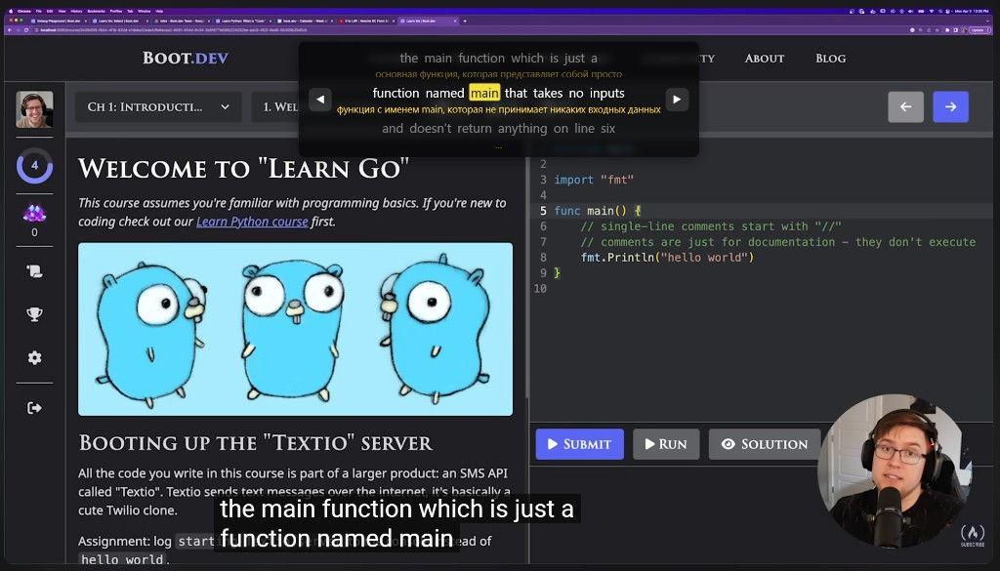

# ytlingo

Расширение для **Google Chrome** и **Microsoft Edge** (Chromium): смотрите обучающие ролики на YouTube на иностранном языке и **понимайте речь в моменте** — оригинал и перевод прямо над видео, без отрыва от экрана.

[Releases](https://github.com/Tetan4ik/ytlingo/releases) · [Сообщить о проблеме](https://github.com/Tetan4ik/ytlingo/issues)



## Что это даёт

- **Двуязычные субтитры** — строка на языке видео и перевод (по умолчанию на русский) в одном блоке над плеером.
- **Синхронизация с видео** — при воспроизведении подсвечивается слово, которое сейчас произносится; текущая реплика ярче соседних.
- **Контекст** — несколько реплик до и после текущей (3–11 строк), чтобы не терять нить объяснения в лекциях и туториалах.
- **Словарь** — клик по любому слову в оверлее сохраняет его с переводом; список можно экспортировать в CSV.
- **Навигация** — кнопки ◀ / ▶ переключают реплики и перематывают видео на начало фразы (удобно, если что-то не расслышали).

Подходит для языковых курсов, IT-уроков, докладов и любого контента, где включены субтитры YouTube (CC).

## Как это работает

1. Вы открываете видео на YouTube и **включаете субтитры (CC)**.
2. Расширение перехватывает ответ YouTube с текстом субтитров (`/api/timedtext`, формат JSON3) — так же, как их получает плеер.
3. **content script** строит оверлей над видео, подписывается на `timeupdate` и выбирает активную реплику по таймкодам.
4. Строки переводятся через публичный endpoint Google Translate (`gtx`); повторные фразы кэшируются.
5. Слова в текущей реплике разбиваются по таймкодам сегментов (или равномерно по длительности фразы) — отсюда подсветка «говорящего» слова.
6. Сохранённые слова лежат локально в браузере (`chrome.storage.local`), без облачного аккаунта в самом расширении.

При переходе на другое видео (SPA-навигация YouTube) расширение ждёт новый поток субтитров и перезапускается.

## Возможности (кратко)

| Функция | Описание |
|--------|----------|
| Оверлей | Полупрозрачная панель по центру сверху видео |
| Перевод | Авто, язык источника определяется автоматически |
| Подсветка | Слово «в речи» выделяется цветом |
| Словарь | Попап «Мой словарь», удаление, экспорт CSV, отдельное окно |
| Настройка | Количество видимых строк субтитров в попапе |

## Установка

### Из исходников (режим разработчика)

```bash
git clone https://github.com/Tetan4ik/ytlingo.git
cd ytlingo
```

1. Откройте `chrome://extensions` (в Edge: `edge://extensions`).
2. Включите **Режим разработчика**.
3. **Загрузить распакованное расширение** → выберите папку `ytlingo` (где лежит `manifest.json`).
4. На YouTube откройте видео, **включите CC**, дождитесь статуса «Работает».

### Из архива

```powershell
.\pack.ps1
```

Файл `dist/ytlingo-v1.0.zip` — распакуйте и загрузите как распакованное расширение (шаги выше). Готовые сборки — в [Releases](https://github.com/Tetan4ik/ytlingo/releases).

## Использование

| Действие | Как |
|----------|-----|
| Словарь | Иконка расширения → «Мой словарь» |
| Сохранить слово | Клик по слову в оверлее |
| Экспорт | «Экспорт CSV» в попапе |
| Отдельное окно | Кнопка «В окне» |
| Число строк | Выпадающий список в попапе |

Статус инициализации — в углу страницы YouTube (`#yt-lang-helper-status`).

## Структура проекта

| Файл | Назначение |
|------|------------|
| `manifest.json` | Manifest V3 |
| `page_script.js` | Перехват `/api/timedtext` (MAIN world) |
| `content.js` | Оверлей, перевод, словарь |
| `popup.*` | Интерфейс словаря |

## Требования

- Chrome / Edge 88+
- `https://www.youtube.com/*`
- Включённые субтитры (CC) на ролике

## Ограничения

- Только YouTube; перевод через неофициальный endpoint — возможны лимиты и сбои.
- Установка вне магазина — режим разработчика или zip из Releases.

## Поддержать проект

Кнопка **Sponsor** в шапке репозитория ([`.github/FUNDING.yml`](.github/FUNDING.yml)).

**[Поддержать на DonatePay](https://widget.donatepay.ru/widgets/page/f37569d679fedd41e646b89ec8af4187d833a500fea8a9a299e21811fc28f216?widget_id=7879740&sum=200)**

## Лицензия

[MIT](LICENSE)
